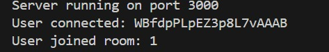
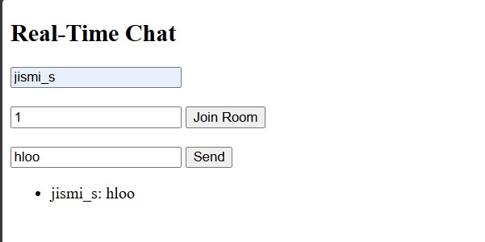

 Real-Time Chat Backend

This project is a real-time chat backend developed using Node.js and Socket.IO.
It supports multiple chat rooms and real-time communication using WebSockets.

 Technologies Used
- Node.js
- Express.js
- Socket.IO

Features
- Real-time messaging
- Multiple chat rooms
- WebSocket-based communication

 Output Screenshots

 Server Status

Chat Interface

 Multiple Chat Rooms

 How to Run
1. npm install
2. node server.js
3. Open http://localhost:3000
